# Milestone 2

### Problem Statement

### Solution Concept
A mobile web application that has a recipe database which stores recipes created by users and recipes pulled from different websites. It recommends recipes to user based on their preferences. Allows users to favorite/bookmark recipes, add them to a calendar to help them plan their meals. Also creates an automated grocery list for users based on recipes they've planned.

### Storyboards
**Storyboard 1**
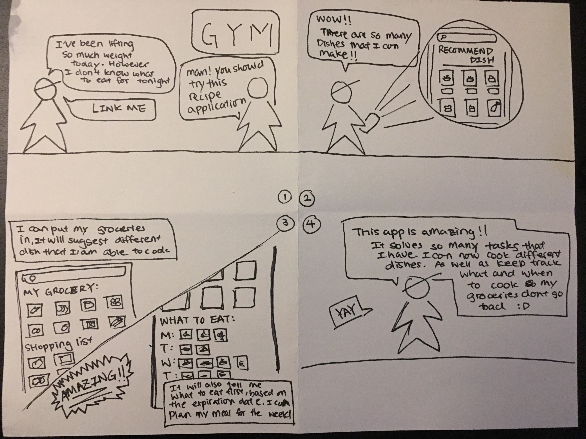

**Storyboard 2**
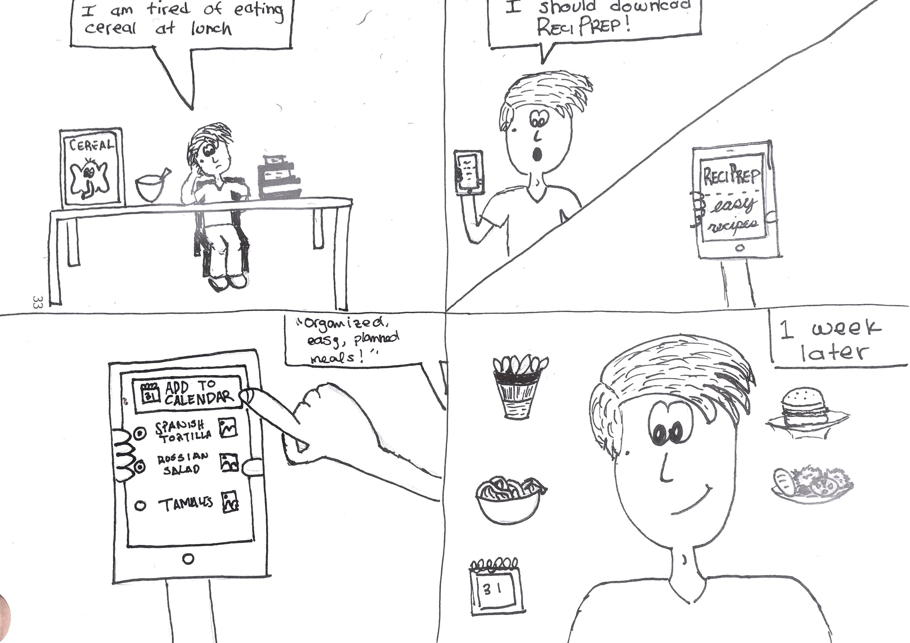

### Low Fidelity Prototypes
**Prototype 1**

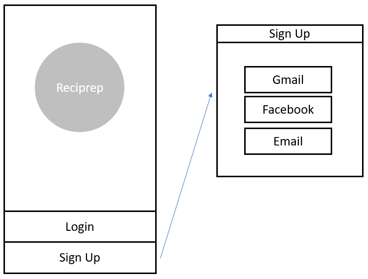
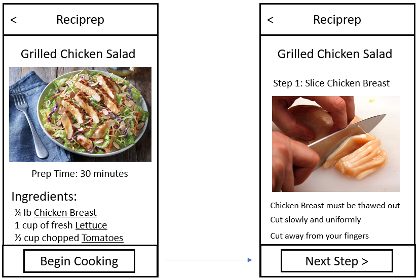
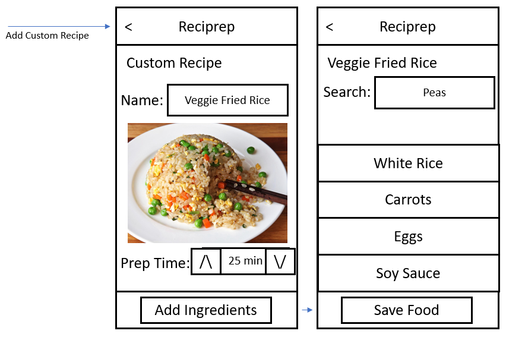
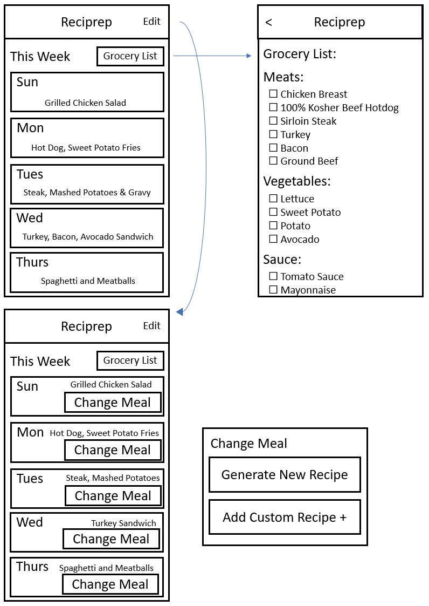
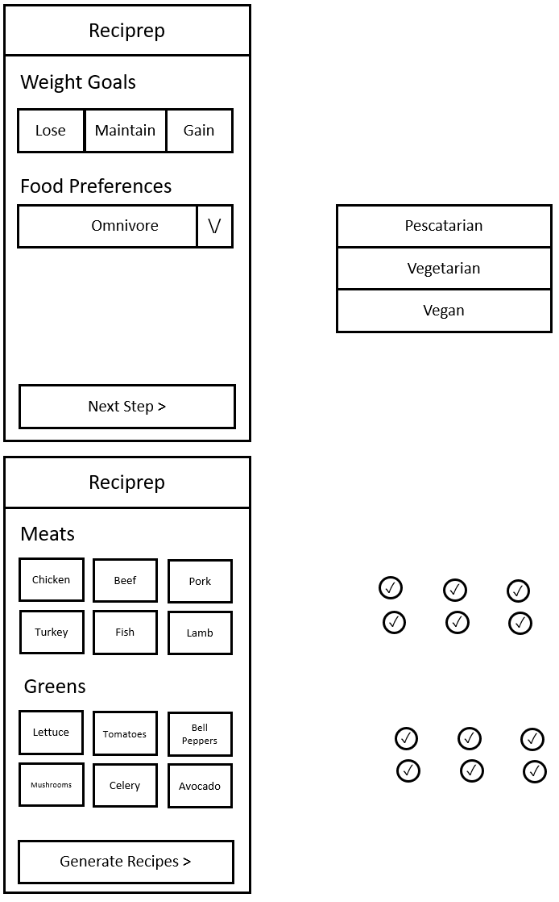

**Prototype 2**

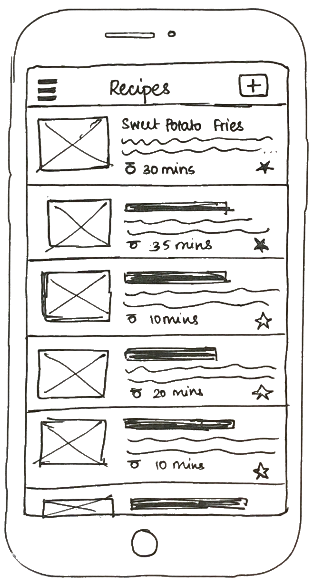

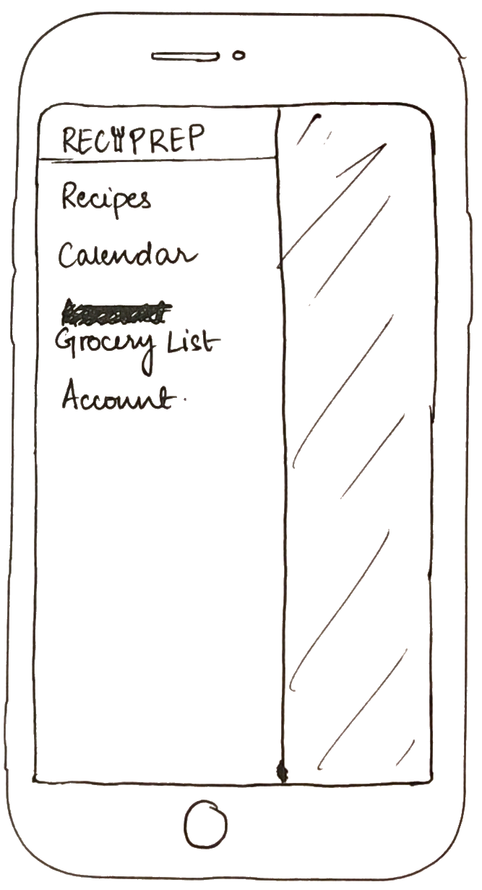
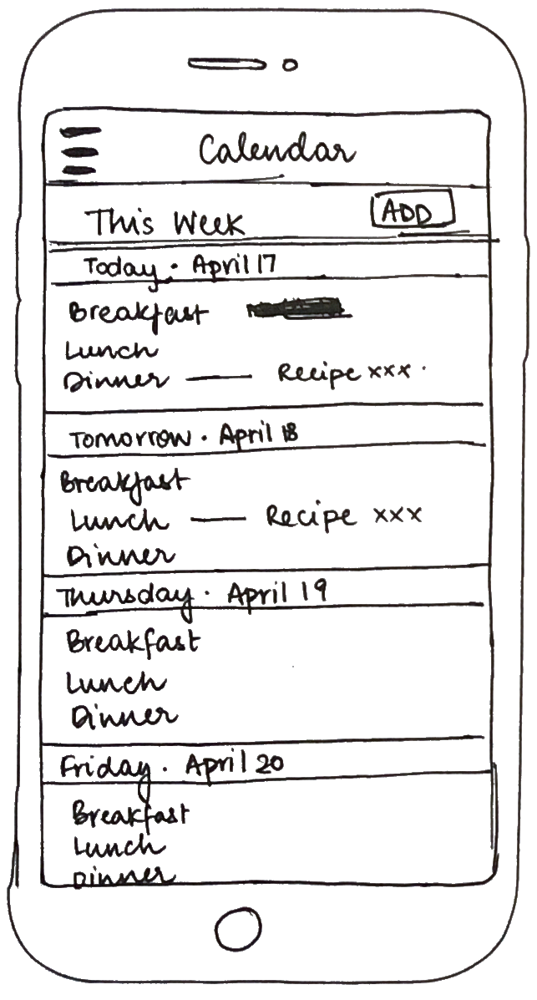

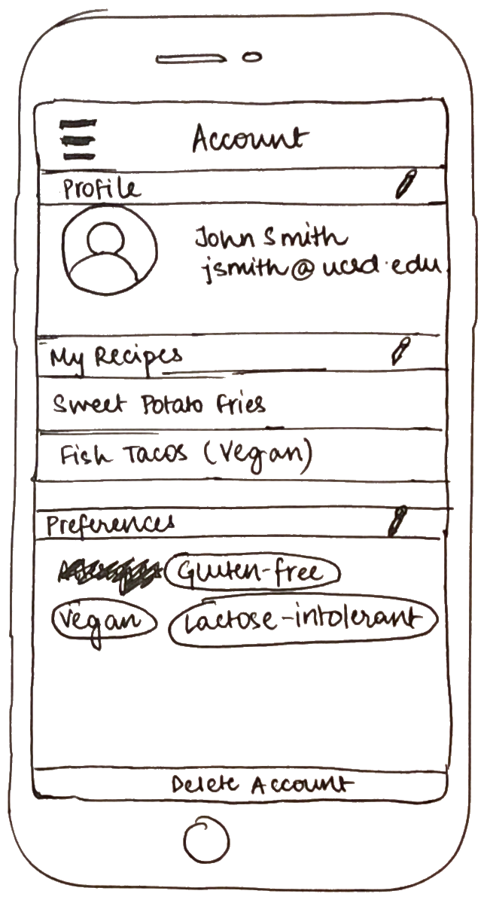
